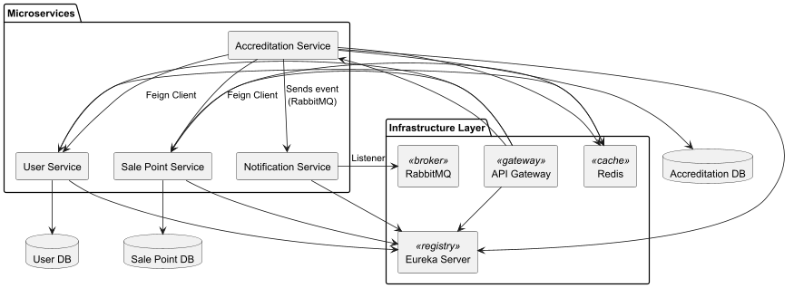
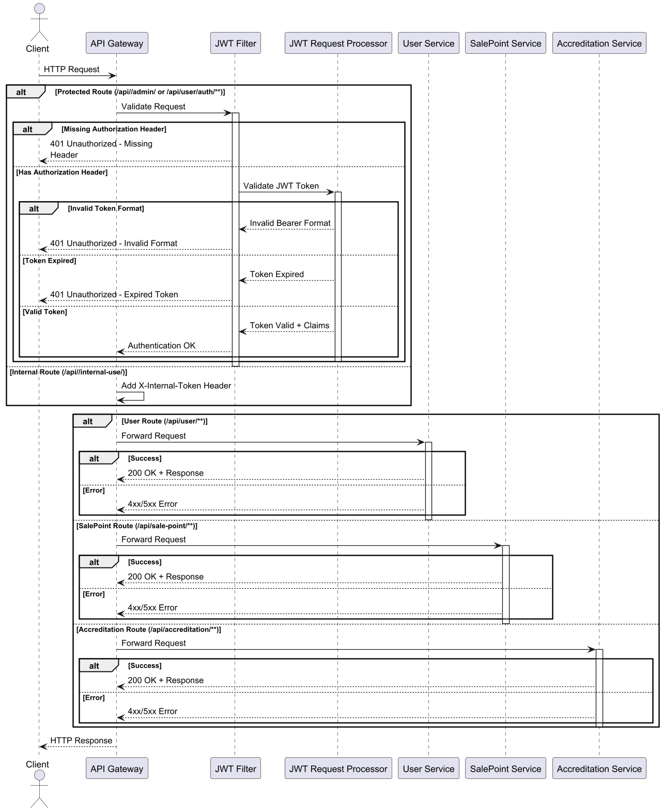
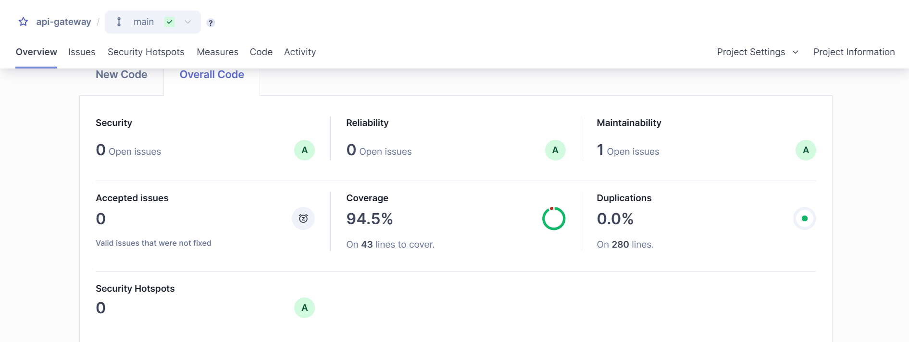

# ☁️ API Gateway

## 📘 Language Directory

- [English Version](#-api-gateway-english)
- [Versión en Español](#-api-gateway-español)

---

> Gateway service that routes requests to microservices securely via role-based JWT validation and internal service tokens.

---

## 🧾 Api Gateway (English)

### 🌐 Overview

The API Gateway acts as the unified entry point to the entire microservices ecosystem:

- 🔐 Verifies JWT tokens for secured endpoints
- 🎫 Forwards user and role information in headers
- 🧭 Registers with Eureka and uses load-balanced URIs (`lb://`)
- 🛡 Adds internal-use tokens where required

This is the interaction between the gateway and microservices:



And this is the sequence of a typical request:



---

### 🛣 Routing Config

| Path Prefix                           | Routed to                   | Filter                             |
|--------------------------------------|-----------------------------|------------------------------------|
| `/api/user/auth/**`                  | `user-service`              | No auth                            |
| `/api/user/admin/**`                 | `user-service`              | JWT – Admin only                   |
| `/api/sale-point/admin/**`           | `sale-point-service`        | JWT – Admin only                   |
| `/api/sale-point/cost/admin/**`      | `sale-point-service`        | JWT – Admin only                   |
| `/api/accreditation/admin/**`        | `accreditation-service`     | JWT – Admin only                   |
| `/api/accreditation/user/**`         | `accreditation-service`     | JWT – User only                    |
| `/api/user/admin/internal-use/**`    | `user-service`              | Internal token                     |
| `/api/sale-point/admin/internal-use/**` | `sale-point-service`      | Internal token                     |

---

### 🔒 Security & Authorization

All requests except `/api/user/auth/**` are validated via the custom `JwtAuthenticationFilter`. The filter performs:

- Header verification: `Authorization: Bearer <token>`
- Expiration check
- Role enforcement:
    - `ADMIN` required for any route with `/admin/`
- Headers added:
    - `X-Username`
    - `X-Role`

If validation fails, the request returns appropriate HTTP errors via `ErrorResponseBuilder`.

---

### 🧱 Dependencies

- Spring Cloud Gateway
- Eureka Discovery Client
- JWT (via `jjwt`)
- Spring Security (fully disabled to allow gateway-level auth)
- JUnit & Mockito

---

### 📬 Internal Headers

For `/internal-use/**` routes, the gateway adds:

```
X-Internal-Token: {internal.secret.token}
```

Used to protect sensitive internal APIs.

---

### 🧪 Tests

- ✅ Unit tests using **Mockito** & **JUnit 5**
- ✅ Full coverage of:
    - JWT token validation logic
    - Gateway filter behavior
    - Header injection

---

### 📊 SonarQube & Coverage

- SonarQube project: `gateway-service`
- Jacoco plugin configured
- **Test Coverage: `94.5%`** ✅




---
### 📁 Project Structure


```
gateway-service/
├── src/
│   ├── main/
│   │   └── java/com/accenture/gateway/
│   │       ├── config/
│   │       ├── exceptions/
│   └── test/
│       └── ...
├── README.md
├── pom.xml
```


---

## 🧾 Api Gateway (Español)

### 🌐 Descripción General

> Servicio de entrada que enruta solicitudes a los microservicios con validación JWT y tokens internos.

### 🔐 Seguridad

- Verifica JWTs en endpoints sensibles
- Inyecta headers con usuario y rol
- Añade token interno en rutas internas
- Desactiva la seguridad web para delegarla al filtro

Esta es la interacción entre el gateway y los microservicios:


Y esta es la secuencia de una solicitud típica:


### 🛣 Rutas

| Prefijo de Ruta                         | Microservicio Destino         | Protección                         |
|----------------------------------------|-------------------------------|------------------------------------|
| `/api/user/auth/**`                    | `user-service`                | Sin autenticación                  |
| `/api/user/admin/**`                   | `user-service`                | Requiere ADMIN                     |
| `/api/sale-point/admin/**`             | `sale-point-service`          | Requiere ADMIN                     |
| `/api/sale-point/cost/admin/**`        | `sale-point-service`          | Requiere ADMIN                     |
| `/api/accreditation/admin/**`          | `accreditation-service`       | Requiere ADMIN                     |
| `/api/accreditation/user/**`           | `accreditation-service`       | Requiere USER                      |
| `/api/user/admin/internal-use/**`      | `user-service`                | Token Interno                      |
| `/api/sale-point/admin/internal-use/**`| `sale-point-service`          | Token Interno                      |

---

### 🧪 Pruebas

- Pruebas unitarias con **Mockito y JUnit**
- Verificación de tokens, headers y filtros
- Compatible con SonarQube + Jacoco
- **Cobertura de código: `94.5%`**


---

### 📁 Estructura del Proyecto

```
gateway-service/
├── src/
│   ├── main/
│   │   └── java/com/accenture/gateway/
│   │       ├── config/
│   │       ├── exceptions/
│   └── test/
│       └── ...
├── README.md
├── pom.xml
```

